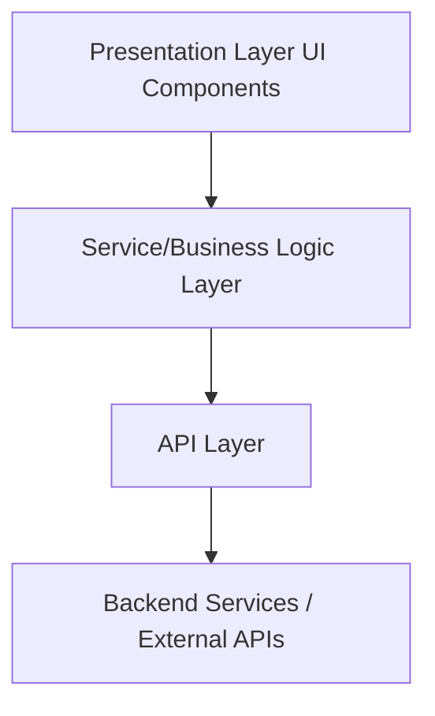
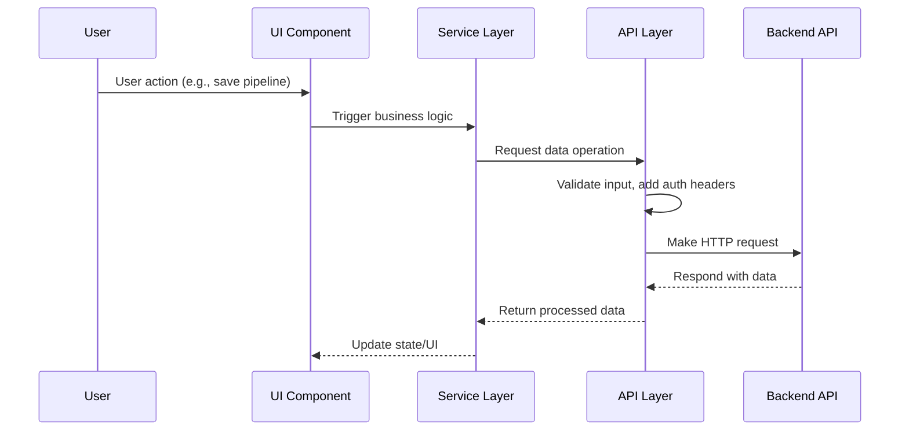

# DevOps Pipeline UI Wizard

This project is a proof-of-concept UI for building DevOps pipelines visually. It allows users to add stages, jobs, and tasks with a graphical interface inspired by Azure DevOps YAML pipelines.

## **Installation**
1. Clone the repo: `git clone https://github.com/your-repo/devops-pipeline-ui.git`
2. Navigate to the directory: `cd devops-pipeline-ui`
3. Install dependencies: `npm install`
4. Start the application: `npm start`

## **Features**
- Drag-and-drop pipeline creation
- Configurable nodes for stages, jobs, and tasks
- React Flow integration for visual editing

## **Roadmap**
- Export pipeline to YAML
- UI validation for stage dependencies
- Database integration for saving pipelines

## Project Description

**DevOps Pipeline UI** is a web-based visual editor designed to simplify the creation, configuration, and management of DevOps pipelines. Its primary goal is to empower development and operations teams to design and automate CI/CD workflows without the need to manually edit complex YAML or JSON files. By providing an intuitive drag-and-drop interface, the tool reduces errors, accelerates onboarding, and enhances collaboration across teams.

### Intended Use / Goal

- **Simplify Pipeline Creation:**  
  Enable users to visually construct and modify build, test, and deployment pipelines for various DevOps platforms.
- **Reduce Human Error:**  
  Provide validation and real-time feedback to prevent misconfigurations and common mistakes.
- **Increase Productivity:**  
  Allow teams to quickly iterate on pipeline designs and share templates or reusable steps.
- **Promote Collaboration:**  
  Make pipeline logic accessible and understandable to both developers and non-developers.

### Core Features

- **Visual Pipeline Editor:**  
  Drag-and-drop interface for adding, removing, and connecting pipeline stages and jobs.
- **YAML/JSON Import & Export:**  
  Seamless conversion between visual pipelines and code-based definitions.
- **Validation & Error Highlighting:**  
  Real-time feedback on configuration issues or missing parameters.
- **Pipeline Templates:**  
  Predefined templates for common CI/CD scenarios to accelerate setup.
- **Version Control Integration:**  
  Ability to save, load, and manage pipeline definitions from Git repositories.
- **Responsive UI:**  
  Works across desktops, tablets, and mobile devices.

### Nice-to-Have Features (Future Roadmap)

- **Integration with Major DevOps Platforms:**  
  Direct support for Azure DevOps, GitHub Actions, GitLab CI, Jenkins, etc.
- **Real-Time Collaboration:**  
  Multiple users editing the same pipeline simultaneously.
- **Role-Based Access Control:**  
  Permissions and approvals for editing or deploying pipelines.
- **Pipeline Analytics:**  
  Visualization of pipeline execution history, bottlenecks, and success rates.
- **Custom Step Marketplace:**  
  Community-driven repository of reusable pipeline steps and actions.
- **Automated Documentation Generation:**  
  Generate human-readable documentation from pipeline definitions.
- **Dark Mode and Custom Themes:**  
  Personalize the UI for user preferences.

---

This project aims to bridge the gap between code-centric and visual approaches to DevOps automation, making pipeline management more accessible, reliable, and efficient for modern software development teams.

## Technologies / Stack

This project uses the following technologies:

- **[React](https://react.dev/)**  
  A JavaScript library for building user interfaces using a component-based architecture.

- **[TypeScript](https://www.typescriptlang.org/)**  
  A strongly typed programming language that builds on JavaScript, providing static type checking.

- **[Node.js](https://nodejs.org/)**  
  A JavaScript runtime used for running development tools and scripts.

- **[npm](https://www.npmjs.com/)** or **[Yarn](https://yarnpkg.com/)**  
  Package managers for installing and managing project dependencies.

- **[Jest](https://jestjs.io/)**  
  A delightful JavaScript testing framework for unit and integration tests.

- **[React Testing Library](https://testing-library.com/docs/react-testing-library/intro/)**  
  A library for testing React components in a user-centric way.

- **[CSS Modules](https://github.com/css-modules/css-modules)**  
  A styling solution that scopes CSS by automatically creating unique class names.

- **[ESLint](https://eslint.org/)**  
  A tool for identifying and fixing problems in JavaScript/TypeScript code.

- **[Prettier](https://prettier.io/)**  
  An opinionated code formatter to ensure consistent code style.

> Additional libraries and tools may be included as the project evolves.

## Application Architecture

The architecture of **DevOps Pipeline UI** is designed for maintainability, scalability, and security. It follows clean code principles and OWASP best practices, ensuring a clear separation of concerns and secure handling of data.

### Layered Architecture

The application is structured in layers, with a dedicated **API Layer** responsible for all communication with backend services. All UI components interact exclusively with this API Layer, ensuring that business logic, data validation, and security checks are centralized and consistently enforced.

#### Layers Overview

- **Presentation Layer (UI Components):**
  - Handles user interaction and rendering.
  - Does not make direct API calls; interacts only with the API Layer.
- **API Layer:**
  - Centralizes all HTTP requests and API integrations.
  - Handles authentication, error handling, and data transformation.
  - Implements security best practices (e.g., input validation, secure storage of tokens).
- **Service/Business Logic Layer:**
  - Contains application logic, validation, and state management.
  - Interacts with the API Layer for data operations.
- **Utilities/Helpers:**
  - Shared functions for formatting, validation, etc.

#### Architecture Diagram

### API Call Flow

All API calls follow a strict flow to ensure security and maintainability:

### Security & Best Practices

- **Clean Code:**  
  - Each layer has a single responsibility.
  - No direct API calls from UI components.
  - Code is modular, readable, and well-documented.
- **OWASP Best Practices:**  
  - Input validation and sanitization at the API Layer.
  - Secure handling of authentication tokens (e.g., HTTP-only cookies, secure storage).
  - Error handling avoids leaking sensitive information.
  - Protection against XSS, CSRF, and other common web vulnerabilities.
- **Testing:**  
  - Unit and integration tests for all layers, especially the API Layer.

---

This architecture ensures that the application is robust, secure, and easy to maintain or extend as requirements evolve.

## Contributions

We welcome and value contributions from the GitHub community! All contributors who have helped improve this project—through code, documentation, bug reports, or feature suggestions—are recognized and appreciated.

### How Contributors Are Recognized

- **In the Application:**  
  There will be an **About** page/component in the application that lists all contributors, along with the current application version and release date.
- **On GitHub:**  
  Contributors are also acknowledged through GitHub's contributors list and in pull request history.

### How to Contribute

1. Fork the repository and create your branch from `main`.
2. Make your changes, ensuring they follow the project's guidelines.
3. Add yourself to the contributors list if your contribution is significant.
4. Submit a pull request for review.

## Contributors

We gratefully acknowledge the following individuals for their contributions to this project:

- [List of GitHub usernames or names here]
- @masterzdran
- [Your name could be here!]

If you have contributed code, documentation, bug reports, or feature suggestions, your name will appear here and on the application's About page.

To become a contributor, please see the [Contributions](#contributions) section above for guidelines on how to contribute.

## Globalization & Internationalization (i18n) Support

The application will support globalization and internalization (i18n) to enable multi-language user interfaces and content. This ensures accessibility and usability for users worldwide.

### Implementation Plan

- **i18n Library Integration:**  
  Integrate a popular i18n library such as [react-i18next](https://react.i18next.com/) for React applications.
- **Language Resource Files:**  
  Store translations in separate JSON files for each supported language (e.g., `en.json`, `es.json`, `fr.json`).
- **Language Switcher:**  
  Provide a UI component for users to select their preferred language.
- **Component Localization:**  
  All UI text, labels, and messages will use translation keys instead of hardcoded strings.
- **Extensibility:**  
  Easily add new languages by creating new translation files.

### Tasks

1. Add `react-i18next` and `i18next` to the project dependencies.
2. Create a folder structure for language resource files (e.g., `/src/locales/en.json`).
3. Configure i18n provider at the root of the application.
4. Refactor components to use translation keys.
5. Implement a language switcher component in the UI.
6. Add initial translations for at least two languages (e.g., English and Spanish).
7. Document how to add new languages and contribute translations.

---

**Note:** All new features and UI components must use the i18n system for any user-facing

